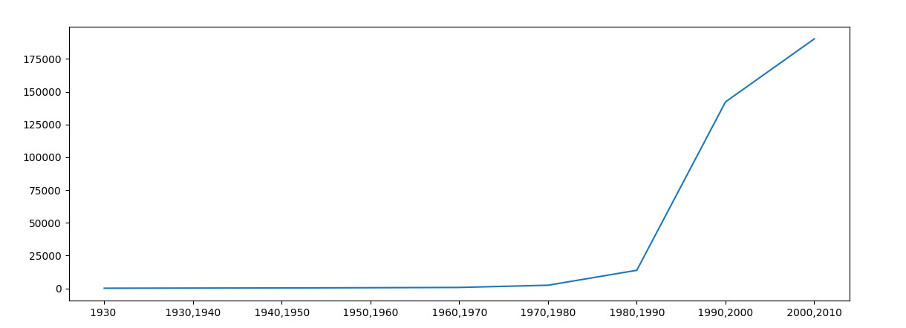

<h1 align="center">Frequencia de Nomes no Brasil</h1>

Este projeto mostra um gráfico com a incidência do nome pesquisado no Brasil até 2010, esse sistema usa:  conexão com a <a href="https://servicodados.ibge.gov.br/api/docs/"> API de Serviço de Dados do IBGE</a>, Python e <a href="https://matplotlib.org/2.0.2/index.html">Matplotlib</a>.

 

<a>Nome Pesquisado: Matheus</a>

🚀 Projeto em andamento
